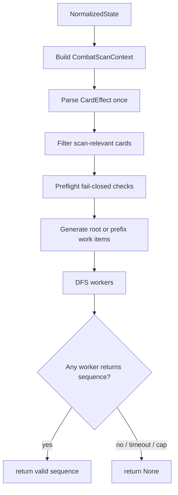

# Kill Scanner Architecture

Implementation architecture for the deterministic visible-hand kill scanner
specified in [`kill-scan.md`](kill-scan.md).

The scanner answers one question:

> can the currently visible hand guarantee ending combat this turn?

It is a fail-closed certifier. Unsupported mechanics, state caps, or timeouts
return `false`.

---

## 1. Boundaries

### In Scope

- Current visible hand only.
- Deterministic card sequencing over scan-relevant cards.
- Targeted, AoE, simple random-target finishers, X-cost attacks.
- Stance, energy, Strength, Vulnerable, execute, deterministic exhaust/consume.
- The monster powers listed in `kill-scan.md`.
- A hard `2s` deadline, up to 8 worker threads.

### Out of Scope

- Draw and generated cards.
- Potions.
- Relic side damage.
- Poison/end-of-turn kills.
- Expected-value random lines.
- Full combat simulation beyond the modeled mechanics.

Out-of-scope mechanics can cause false negatives. They must not cause false
positives.

---

## 2. Proposed Module Layout

Add a focused combat module:

```
src/combat/
  mod.rs
  kill_scan.rs      // public scanner API and thread orchestration
  effects.rs        // CardInfo -> CardEffect parser
  context.rs        // NormalizedState -> CombatScanContext
  damage.rs         // resolve modeled card effects against snapshots
  memo.rs           // compact state keys and budget accounting
```

Tests can live under `src/tests/kill_scan_tests.rs`, matching the existing
inline test-module pattern.

Keep this module independent from prompts, LLM calls, command writing, and
autoplay session state.

---

## 3. Public API

Keep the public surface small:

```rust
pub struct KillPlay {
    pub card: String,           // CardInfo.uuid
    pub target: Option<usize>,  // MonsterInfo.index command target, None for non-targeted cards
}

pub type KillSequence = Vec<KillPlay>;

pub fn find_kill_sequence(state: &NormalizedState) -> Option<KillSequence>;

pub fn find_kill_sequence_with_options(
    state: &NormalizedState,
    options: KillScanOptions,
) -> Option<KillSequence>;

pub(crate) fn find_kill_sequence_from_context(
    ctx: CombatScanContext,
    options: KillScanOptions,
) -> Option<KillSequence>;

pub fn can_end_fight(state: &NormalizedState) -> bool;
```

`find_kill_sequence` is the primary API. It builds the context, parses effects,
filters scan-relevant cards, and returns any deterministic kill sequence that
guarantees combat end.

`can_end_fight` is a convenience wrapper:

```rust
pub fn can_end_fight(state: &NormalizedState) -> bool {
    find_kill_sequence(state).is_some()
}
```

`find_kill_sequence_from_context` is for ranker/autoplay code that has already
applied a candidate play to a scan context.

Options are operational only:

```rust
pub struct KillScanOptions {
    pub deadline: Duration,      // default: 2 seconds
    pub worker_threads: usize,   // default: min(8, available_parallelism)
    pub max_expanded_states: usize,
    pub max_memo_entries: usize,
}
```

The returned sequence is command-facing:

```json
[
  { "card": "uuid-1", "target": 0 },
  { "card": "uuid-2", "target": null }
]
```

`target` is `MonsterInfo.index`, the raw command target index preserved by
`NormalizedState` and sent to CommunicationMod's `play` command. It is `null`
for non-targeted cards. It is not the scanner's internal living-monster vector
position. A UUID-only `Vec<CardUUID>` can be derived by callers that only need
card order.

---

## 4. Data Flow



Important rule: parsing and description matching happen before DFS. DFS should
operate on compact parsed effects and snapshots only.

---

## 5. Context Builder

`context.rs` converts `NormalizedState` into scanner input:

- hand cards
- current energy
- player stance
- current Strength delta baseline
- Chemical X bonus
- monster hp/block/powers/minion flag and command target index
- remaining card-play limit

Some required facts are not currently exposed by `NormalizedState`. The builder
must fail closed until they are added upstream:

| Required fact | Why it matters | Current risk if missing |
|---------------|----------------|-------------------------|
| `cards_played_this_turn` | Velvet Choker, Normality, and Time Eater remaining play count | false positives from allowing too many plays |
| normalized card-play limit or raw counters | same as above | false positives around play caps |
| Chemical X ownership/counter | X-cost damage amount | false negatives if ignored, false positives if guessed |
| reliable player stance ids | stance transition damage/energy | false positives if stance is inferred wrong |

Until those fields exist, use only limits that can be proven from existing
state. If a relevant limiter is present but its remaining count cannot be
computed exactly, return `None` from the context builder.

The builder also performs state-level fail-closed checks. If an unsupported
dangerous monster power is present, or required upstream data is missing, the
builder returns `None` and the public API returns `None`/`false`.

The builder should not parse card text. That belongs in `effects.rs`.

---

## 6. Effect Parser

`effects.rs` converts each `CardInfo` into `CardEffect`.

Parser responsibilities:

- damage amount and hit count
- targeted / AoE / random-target classification
- Vulnerable
- energy gain
- Strength gain
- stance / Mantra
- execute threshold
- X-cost flag
- deterministic exhaust/consume shape

Parser non-goals:

- no draw simulation
- no generated card simulation
- no fuzzy strategy interpretation

If a card has modeled damage plus unsupported hand mutation, keep it as a
possible final play. `damage.rs` resolves the modeled damage; if combat has not
ended after that card, the branch stops.

Rendered card text is not always enough. CommunicationMod card descriptions may
already include player-side one-shot modifiers such as Vigor, Wreath of Flame,
Pen Nib, or similar "next attack" effects. The scanner must not treat those as
permanent damage.

Architectural rule:

- Persistent/current modifiers baked into rendered damage are acceptable.
- Consumable one-shot modifiers must be captured in context and decremented
  after the correct attack.
- If a one-shot modifier may be present but cannot be identified and modeled,
  the context builder fails closed.

---

## 7. Search State

Use compact, owned state. Avoid string-heavy keys in DFS.

```rust
struct SearchState {
    remaining_mask: u16,
    energy: i16,
    depth: u8,
    stance: Stance,
    strength_delta: i16,
    monsters: Vec<MonsterState>, // tiny in practice; fixed arrays are optional
}
```

`remaining_mask` indexes into the filtered scan-relevant card list. The hand
limit is at most 10, so `u16` is enough.

Monster snapshots should store the command target identity plus modeled mutable
fields:

```rust
struct MonsterState {
    command_index: usize, // MonsterInfo.index; value sent to `play`
    hp: i16,
    block: i16,
    powers: Vec<PowerState>,
    is_minion: bool,
}
```

No heap allocation should be necessary in the inner damage loop for normal
combat sizes.

Numeric policy:

- Store mutable scanner values as `i16`: hp, block, energy, Strength delta, and
  modeled power amounts.
- It is fair to assume supported/base-game scanner states fit those bounds.
- Convert `NormalizedState` `i64` values into scanner `i16` at the boundary.
- If a value does not fit, treat it as unsupported and fail closed.
- For formulas such as `damage * hits`, temporarily widen to `i32`/`i64` or use
  checked arithmetic, then checked-convert back when writing stored state.
- Never rely on release-mode wrapping behavior.

This keeps memo keys compact while still making overflow behavior explicit.

---

## 8. DFS Loop

Search order:

1. Check combat-end condition.
2. Check depth, state, memo, and deadline budgets.
3. Iterate remaining scan-relevant cards.
4. Generate legal plays:
   - targeted cards: one branch per living target
   - AoE / energy / Strength / stance: one branch
   - deterministic exhaust/consume: one branch
   - X-cost: one branch using all current energy
   - random-target: one branch only when the closed-form guarantee passes
5. Resolve one child state.
6. Recurse.
7. When a child returns a sequence, prepend the current `{card, target}` play and
   return it.

Random-target cards that fail the guarantee formula are skipped at that state.
They can become valid later after deterministic setup cards reduce durability.

Use a fixed local traversal for reproducibility and easier debugging, but the
public API may return any valid sequence, especially when parallel search is
enabled:

1. lower hand index first
2. lower command target index first for targeted cards
3. deterministic modeled branches before final-play-only unsupported branches

---

## 9. Memoization

Memo key should include every modeled field that can affect future search:

- remaining card mask
- energy
- depth or remaining play count
- stance
- Strength delta
- monster hp/block/power state

Do not include fields that cannot affect modeled future search. Keeping the key
small matters more than sharing it across threads.

Memo value should be tri-state:

- `Unknown`: not evaluated
- `DeadEnd`: no sequence from this state
- `Solved(KillSequence)`: suffix sequence from this state

Recommended starting point:

- per-worker memo tables
- per-worker expanded-state counters
- global atomic expanded-state cap
- global cancellation flag plus a shared winning sequence slot

Use shared memoization only if profiling shows it wins; lock contention can cost
more than duplicate work at this search size.

---

## 10. Parallel Execution

Parallelize coarsely.

1. Build root plays.
2. If root branching is too small, build first-two-depth prefixes.
3. Push prefixes into a shared queue.
4. Run up to 8 workers until:
   - any worker returns a valid kill sequence
   - deadline expires
   - global state cap is reached
   - queue is exhausted

Workers should check cancellation/deadline at regular DFS boundaries, not inside
every tiny arithmetic operation. When one worker finds a sequence, store it and
cancel the rest. The returned sequence is correct if it is executable and
guarantees combat end; it does not need to be the earliest sequence in the local
DFS order.

No new dependency is required for the first version. `std::thread::scope`,
`Arc<AtomicBool>`, and `Instant` are enough. If this later lives in async
autoplay code, call it from a blocking context rather than blocking an async task
executor thread.

---

## 11. Budgets

Default production budget:

| Budget | Value | Behavior |
|--------|-------|----------|
| Deadline | 2 seconds | return `false` |
| Threads | up to 8 | split prefix work |
| Expanded states | 2M-10M global starting range | return `false` |
| Memo entries | memory cap from profiling | return `false` |

Budget exits are safe false negatives.

Log these counters when a scan ends:

- elapsed time
- expanded states
- memo entries
- original hand size
- scan-relevant card count
- monster count
- targeted-card count
- whether mutable monster powers were present
- exit reason: `found`, `exhausted`, `deadline`, `state_cap`, `memo_cap`,
  `unsupported_state`

---

## 12. Integration Points

### Ranker

The ranker calls `find_kill_sequence_from_context` when scoring a candidate
play:

1. Apply the candidate play to a scan context.
2. Remove the played card from the visible hand.
3. Run `find_kill_sequence_from_context` on the resulting context.
4. Award the end-fight score only when the scanner returns `Some`.
5. Optionally keep the returned suffix to explain or execute the full line:
   candidate play plus suffix.

### Autoplay Planner

Autoplay can use scanner output as deterministic context before consulting the
LLM. When a sequence is returned, autoplay can execute the ordered `{card,
target}` list directly, subject to normal command validation.

Execution must translate `card` UUID to the current hand index immediately
before each command is sent. Do not cache hand indices from scan time; hand
indices shift after every played card and after deterministic exhaust/consume.
`target` is already the command target index. Validate it against the current
`state.monsters[].index` set and send it unchanged; do not remap it through the
current living-monster vector position. If a sequence step's UUID is no longer
present or the target is no longer legal, stop executing the sequence and fall
back to normal planning.

### Prompt Builder

Prompt text may report scanner facts, but prompt code should not implement scan
logic.

---

## 13. Failure Policy

The scanner may return `None` for:

- unsupported card effect
- unsupported dangerous monster power
- parse ambiguity
- state budget cap
- memo budget cap
- deadline

This is intentional. The architecture optimizes for:

1. zero known false positives in modeled scope
2. useful coverage of common deterministic kills
3. executable kill sequence
4. bounded runtime

---

## 14. Implementation Order

1. Add `src/combat` module skeleton.
2. Implement `CombatScanContext` builder from `NormalizedState`.
3. Implement parser for direct damage, hits, target type, energy, stance,
   Strength, Vulnerable, execute, X-cost, and deterministic exhaust.
4. Implement single-threaded DFS returning `Option<KillSequence>` with memo and
   small state cap.
5. Add tests from `kill-scan.md`.
6. Add random-target closed-form guarantee.
7. Add 2-second deadline.
8. Add coarse 8-worker prefix execution.
9. Integrate into ranker/autoplay scoring.
